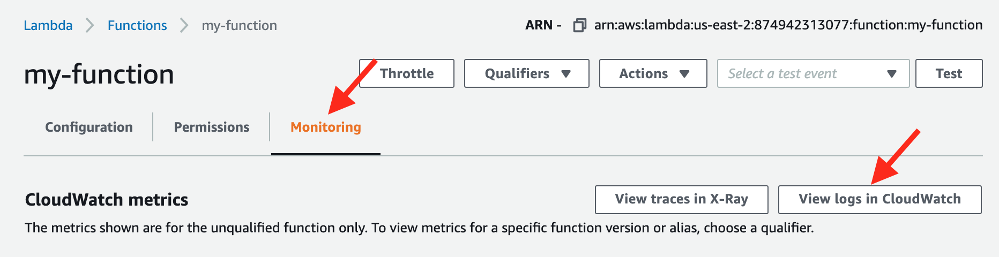
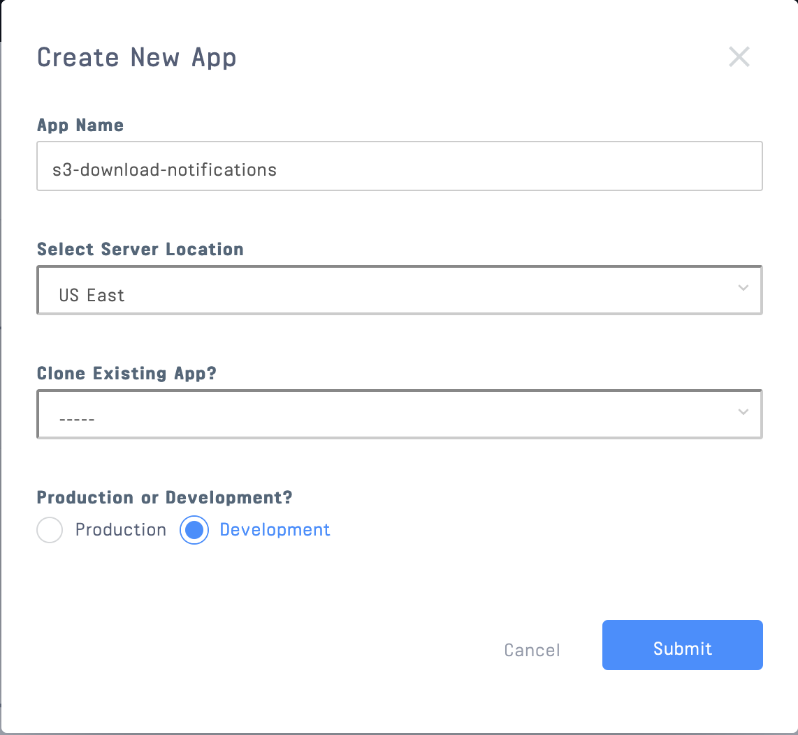

# Get Notified When Cloud Files Are Viewed or Uploaded

**Set up a notification feed for cloud drive uploads and downloads using [Stream Feed](https://getstream.io/activity-feeds/) and Amazon AWS [S3](https://aws.amazon.com/s3/?nc2=h_ql_prod_st_s3)**


Have you ever wanted to confirm that a file you uploaded to a shared drive was downloaded by another user? Has a colleague ever forgotten to let you know they uploaded a cloud file you needed? These situations can lead to a lot of frustration and wasted time. This tutorial demonstrates how to set up notifications for these events using a [Stream Feed](https://getstream.io/activity-feeds/) and Amazon Web Services (AWS) Simple Storage Service (S3).

>**Using a different Cloud Drive?** If you want to monitor notifications from `Google Drive`, `OneDrive`, `SharePoint`, or any other cloud, [jump here](#Custom-Notification-Feed-App) to learn how to build the notification feed with Stream.

While AWS offers notifications for certain actions, neither S3 nor CloudWatch (EventBridge) nor SNS offers a notification for when a file has been viewed or downloaded from S3. This tutorial will show you how to **(1)** create custom AWS notifications and **(2)** build a notification feed in a super quick way using [Stream Feed](https://getstream.io/notification-feeds/) ([free trial](https://getstream.io/)). 


We will use S3, CloudTrail, CloudWatch, Lambda, and Stream to generate a notification feed for S3 activities. Download the Git repository for this project [here](https://github.com/isaidspaghetti/s3-notifications) to follow along.

>**Other Notifications:** You can use the AWS workarounds from this post to customize exactly which notifications you want.

>**Scalability:** Stream Feed is built to be highly customizable and highly scalable. Even if you're looking for an enterprise-scale solution, you're in the right place.

>### [Stream](https://getstream.io/)
>*Build real-time feeds in less time. This app leverages Stream's Notification Feed API to build the most engaging activity feed without worrying about the underlying storage technology. Advanced features such as aggregation, ranking, real-time, and personalization enable your product team to optimize your app’s engagement and retention.*
>- [Stream Feed](https://getstream.io/notification-feeds/)

## 📓 Prerequisites

Setting up AWS won't require specific prior knowledge. To display the data in a notification feed we'll use basic [express](https://expressjs.com/) and [React](https://reactjs.org/). The topics covered are easy to port to other languages and frameworks. 

## ✈️ Gameplan
### AWS Tasks
- [Create S3 bucket](#Create-an-s3-Bucket)
- [CloudTrail logging](#CloudTrail-Configuration)
- [CoudWatch logging](#🔭-CloudWatch-Monitoring)
- [Lambda function](#👩🏽‍🌾-Create-a-Lambda-Function)
### App Tasks
- [Configure Stream Dashboard](#👩🏻‍💻-Custom-Notification-Feed-App)
- [Create feed groups for posting and viewing notifications](#🎳-Feed-Groups)
- [Register a frontend user](#®-Frontend-Registration)
- [Receive an HTTP request from Lambda](#🏄🏽‍♀️-Creating-Activities-in-Stream)
- [Add S3 activities to a feed](#🏄🏽‍♀️-Creating-Activities-in-Stream)
- [Render feed](#🎟-Render-Stream-In-The-Frontend)

Let's get rolling!

## Create an S3 Bucket

Let's start on the Amazon side by setting up all the AWS apps. The first up is S3.

1. If you don't have one already, sign up for an AWS account [here](https://portal.aws.amazon.com/billing/signup?refid=em_127222&redirect_url=https%3A%2F%2Faws.amazon.com%2Fregistration-confirmation#/start). It's free, but you'll need to enter your credit card details. 

2. Log in to your [AWS Console](https://console.aws.amazon.com/) as the `Root user`.

3. Click `Services` and select `S3`


4. In the `S3` console, create a new bucket (images show the updated 2020 console UI).


5. Give your bucket a [unique](https://docs.aws.amazon.com/AmazonS3/latest/dev/BucketRestrictions.html#bucketnamingrules) name. We'll call this one `scuttlebucket`. Take note of the region your bucket will be hosted in. It will be important later. Default settings are acceptable ('Block all public access', Disable 'Bucket Versioning', Disable 'Server-side encryption', Disable 'Object Lock').


>*Note: if you're using an [`Organizational` AWS account structure](https://console.aws.amazon.com/organizations/home#/getting-started), be sure to check `Enable for all accounts in my organization`. You may have to modify some of your account permissions to allow CloudWatch and CloudTrail access across your organization.*

6. Click on your bucket, then `upload` an `object` (any file will do). FYI: AWS refers items in buckets as `objects`. Default object permissions and properties are fine.


Excellent! Now, let's go to CloudTrail to set up logging.

## CloudTrail Configuration

We're ultimately going to use CloudWatch to monitor happenings in S3, but CloudWatch can't tell you anything about `object` downloads without a CloudTrail. Here are the steps to create a CloudTrail that will deposit logs into your S3 account.

1. In the `Services` navbar dropdown, select `CloudTrail`.


2. In the upper-right portion of the navbar, confirm the server location matches the location where you created your S3 bucket. Our CloudTrail instance must be in the same region to monitor our S3 bucket's logs.


3. Select `Create a trail` from the CloudTrail home screen.


4. Name this trail `my-trail`. Use the `Create new S3 bucket` option. This creates the folder where the CloudTrail logs will get stored. It's best to allow AWS to configure this bucket for security and permissions reasons ([learn more here](https://docs.aws.amazon.com/AmazonS3/latest/dev/ServerLogs.html)). 

    For this example, keep things simple by deselecting `SSE-KMS encryption`, `file validation`, and `SNS notification delivery`.


>*Note: **Don't Log your logs!** Avoid monitoring the bucket or folder where you set your CloudTrail logs to be stored; you don't want to create logs of logs!*

5. Check the box to enable `CloudWatch Logs`. Use a new `Log group` and a new `IAM` user. Click `Next`.


6. By default CloudTrail will log `Management` events for `all current and future buckets`. This is a good way to create *way* too much data! 

    In the `Choose log events` page, deselect `Management events` and choose `Data events`. The default event source is `S3`. 
    
    Deselect `Read` and `Write` in `All current and future S3 buckets`. 
    
    In `Individual bucket selection` add the exact bucket name that you just created (mine is `scuttlebucket`). Allow for `Read` and `Write` permissions. 


7. Click `Next`, `Review`, and `Create Trail` on the following screens to finish. Your new CloudTrail log bucket will now be visible in your S3 dashboard


>🚨 **Careful!: At this point, your AWS account is liable for charges. Charges will occur if you exceed the `Free tier` plan of 5GB of Data (ingestion, archive storage, and data scanned by Logs Insights queries).**

>If you're working with just a handful of buckets and objects, this app will produce only KB of data; but be careful if you're running a large S3 service. [Read here](https://aws.amazon.com/cloudwatch/pricing/) for more pricing info.

Excellent, now let's set up the CloudWatch to monitor these logs.

## 🔭 CloudWatch Monitoring 

To have CloudWatch monitor the logs CloudTrail creates, we will create a `CloudWatch Rule`. This `rule` will be set to monitor only `downloads`, `views`, and `uploads` of objects in specific buckets. 

1. Navigate to the `CloudWatch` console.


2. In the left nav pane, select `Rules` and click `Create rule`.


3. In the `Build event pattern to match events by service` dropdown, select `Events by Service`.


4. For `Service Name` select `Simple Storage Service (S3)`. For event type, select `Object Level Operations`


5. Check the radio button for `Specific operation(s)`, select `GetObject` and `PutObject`. This CloudWatch will monitor the CloudTrial logs for any events with the `GetObject` or `PutObject` operators. 

    For the bucket, enter the exact name of the first `bucket` you created in your S3 (mine was `scuttlebucket`, not the logging bucket).


>**🧙‍♂️ Customize Your App**: Step 5 is where you can really customize your notification feed to fit your needs. Once you've got this app running, play around with other operations you'd like to monitor.

6. This CloudWatch now needs a `Target` to point to. As you might have guessed, our    `target` is going to be a `Lambda function`. 


Keep your browser tab open and open a new tab where we will create a `Lambda function` that will make an `HTTP` `POST` to our app.

## 👩🏽‍🌾 Create a Lambda Function

The Lambda created here will take the data from CloudWatch and `POST` it to our express `api`.

1. Get to the `Lambda` page using the `Services` nav-bar dropdown.


2. Click `Create function`


3. Confirm the server location matches the server location from our previous steps. 
  
    Choose `Author From Scratch` (default). 

    Name your function `my-function`. 
    
    For the `Execution role` use `Create a new role with basic Lambda permissions`.

    Click `Create Function`.


4. Copy and paste the following into your `Lambda's` `index.js` file:

### 🐑 Lambda Funcion
```javaScript
//Lambda/my-function/index.js:1
const https = require('https');

exports.handler = (event, context, callback) => {
  if (event.detail.eventName === 'PutObject' | event.detail.requestParameters['response-content-disposition']) {

    const payload = JSON.stringify({
        user: event.detail.userIdentity.userName,
        eventName: event.detail.eventName,
        bucketName: event.detail.requestParameters.bucketName,
        objectName: event.detail.requestParameters.key,
        eventTime: event.detail.eventTime
    });
    
    const options = {
        hostname: "YOUR-URL-GOES-HERE.com", 
        method: "POST",
        path: "/lambda",
        headers: {
        'Content-Type': 'application/json',
        'Content-Length': payload.length
        }
    };
    
    const req = https.request(options, 
        (res) => res.on("data", () => callback(null, "OK")))

    req.on("error", (error) => callback(JSON.stringify(error)));

    req.write(payload);

    req.end();
  }
}
```

>**NOTE:** For the `hostname` do not include 'https://' or any other prefixes to your url. EG: just use `google.com` not `https://google.com`.

Let's break down that code snippet! 

`exports.handler` is the primary function in this `Lambda`. 
 
CloudWatch is going to send either a `PutObject` or a `GetObject` operation to this function. `PutObject` is when a user uploads an object. `GetObject` is used when an object is clicked, rendered, viewed, or downloaded, but we only want to send our `api` information about `views` and `downloads`.

CloudWatch only logs the `['response-content-disposition']` property when a user `views` or `downloads` objects, so we've created a boolean on that to make this function exclusive.

Next, the function destructures the input coming from CloudWatch and stores this `payload` as a string. 

We then declare some options for the `POST`. The `hostname` should match your publically available `url` where you will host your app. 
>We used `ngrok` to temporarily host our app. [Click here](https://ngrok.com/) for instructions on setting up a free `ngrok` account for yourself.

The `path` matches the `backend` `express` endpoint which we will build later. The remainder of the code is boilerplate.

5. `Deploy` the function


### 📏 CloudWatch Rule Configuration (Continued)

1. Back in our CloudWatch, we can now add `my-function` as the `trigger` for our rule. Do so, then click `next`. (You might need to re-load the page for your Lambda function to appear).


2. Name your rule `my-rule`. Make sure `State` is set to `Enabled`. Click `Create Rule`.


Your Lambda function will now be triggered whenever a user downloads, views, or uploads an object in the buckets you specified.

>**To view your Lambda's logs**: from the `my-function` page, click `Monitoring`, click `View logs in CloudWatch`, then select the appropriate `log group` folder. A log group won't be created until the function has been run. You can `Test` your function in the function editor, or wait a few seconds for the logs to appear after uploading or downloading a file.



Awesome Job! 👏 Our AWS services are set up. Now, let's build the app that will receive the Lambda `POST`s and add them to a notification feed using Stream.

## 👩🏻‍💻 Custom Notification Feed App

From here on out we'll focus on our app. We'll bounce a bit between the `frontend` and a backend `api` so that you can get an idea of the workflow. 

We will demonstrate how fast and easy it can be to build a custom feed app when using the [Stream Feed](https://getstream.io/activity-feeds/) infrastructure to do all the heavy lifting.

>**Stream App Workflow** 
>* [Create feed-groups in the Stream dashboard](#🎳-Feed-Groups)
>* [Initialize a server-side Stream client](#🧮-Configure-Environment-Variables)
>* [User registers in the frontend of our app](#®-Frontend-Registration)
>* [Backend api registers the user with this Stream API](#😎-Initialize-Backend)
>* [Backend sends frontend the App Key and App ID](#🔚-Backend-`/registration`-Endpoint)
>* [Frontend renders the `<StreamApp/>` component](#🎟-Render-Stream-In-The-Frontend)
>* [`<FlatFeed/>` accepts arguments for the user and feed group to render](#🍴-The-`<FlatFeed/>`-Component)
>* [Each activity in said feed is rendered by the component passed to the `Activity` prop](#🙈-Rendering-Stream-Activities-in-React)
>* [Actvities are updated live by our Lambda and backend `api`](#🏄🏽‍♀️-Creating-Activites-in-Stream)

Let's dive in!

### 🎬 Initialize Stream Dashboard

When our user logs in, they will be logging into a Stream client, so we will have to register our client with the Stream API first. 

Grab your free Stream trial [here](https://getstream.io/), and see [this post](https://getstream.io/blog/send-chat-transcripts-to-hubspot/) if you need help with signing up.

Once you're signed up, create a Stream Feed app:

1. From the Stream [Dashboard](https://getstream.io/dashboard/), click the `Create App` button.


2. Choose any name for the app and select `development` mode.



Next, we'll learn about and set up some feed groups.

### 🎳 Feed Groups
>*Stream uses [feed groups](https://getstream.io/docs/creating_feeds/?language=js) to help organize your feeds and customize their behavior. It's helpful to have one feed group for adding activities and another for consuming them.*

> **Feed group types**:
>Stream offers 3 [feed group types](https://getstream.io/docs/flat_feeds/?language=js), each with varying behavior:

>*  `Flat` feed groups are the only feeds that can be followed, and therefore are a good type to setup for adding activities. We'll use a `flat` feed for both of our feed groups in this app.

>* `Aggregated` feed groups are good for consuming grouped activities. EG: "Jerry liked 3 of your pictures"

>* `Notification` feed groups make it easy to add notifications to your app. Notifications cannot be followed by other feeds - but you can write directly to a notification feed. To keep our app simple we'll use a flat feed, but check out [this page](https://getstream.io/docs/flat_feeds/?language=js) to learn more about notification feed behaviors.

### Create Stream Feed Groups

1. In the App Dashboard, we will add two new `feed groups` to your app. Name the first one `s3_activities` with the default `flat` group type. (We'll create an `s3` Stream *user* that will curate this feed later).


2. Name the second feed group `user_notifications` with the feed group type `flat`. Each user who uses our app will have a `user_notifications` feed that `follows` the `s3_activities` feed.
    


Your app's feed groups should now look like this:


### 🧮 Configure Environment Variables

Now, let's snatch the Stream API key and Secret, which we'll use in our app to establish our connection with the Stream API.

1. Copy the API key, API secret, and app ID from the app dashboard ...


2. In your app, ([Git repo here](https://github.com/isaidspaghetti/s3-notifications)) paste these items into the file named `.env.example`. 

<!-- https://gist.github.com/isaidspaghetti/75606580cc89b45e1a0d9939d2e72937 -->
```bash
//api/.env
NODE_ENV=development
PORT=8080

STREAM_API_KEY='your stream api key here'
STREAM_API_SECRET='your stream secret here'
STREAM_APP_ID='your app id here'
```

3. Change the filename from `.env.example.` to just `.env`

Now we're ready flow with the app UI.

### ® Frontend Registration

This app is separated between a `frontend` that registers users and renders feeds, and a backend `api` that communicates with Stream and our Lambda function. 

Here's the first page our user will interact with at `localhost:3000`:


Here's the `jsx` rendering this component:

<!-- https://gist.github.com/isaidspaghetti/ca8f158705f40f314b2df17f572f8dff -->
```jsx
//frontend/src/App.js:58
return (
  <div className="App container">
    <form className="card" onSubmit={register}>
      <label className="label-font">Username</label>
      <input className="input-style"
      type="text"
      value={username}
      onChange={(e) => setUsername(e.target.value)}
      placeholder="username"
      required
      />
      <button type="submit">
      Log in
      </button>
    </form>
  </div>
);
```

This is a simple `react` form with the state variable `username`. For more help on creating this form check out [this post](https://getstream.io/blog/how-to-capture-leads-from-live-chat-in-hubspot).

The `log-in` button triggers the `register` function. Here's that function:

<!--https://gist.github.com/isaidspaghetti/b74a59cf285f085ab6bec854a97f8a42-->
```jsx
//frontend/src/App.js:18
const register = async (e) => {
  try {
    e.preventDefault();

    var response = await axios.post('http://localhost:8080/registration', {
      frontendUser: username
    });

    setStreamCredentials({ token: response.data.userToken, apiKey: response.data.streamApiKey, appId: response.data.appId });

  } catch (e) {
    console.error(e, e.error);
  }
};
```

This function sends an `axios` request to our backend `api` and includes the `username`. (We call it `frontendUser` to help organize our backend). Our backend will generate a `userToken`, `apiKey`, and `appId` in response. These three items are required for rendering the Stream client.

Let's initialize our backend `api` and look at that `/registration` endpoint.

### 😎 Initialize Backend

The heart of the backend is in `index.js`. Let's start by instantiating Stream with the npm package `getstream`. (If you're starting from scratch use `npm install --save getstream`). This package gives us all of our infrastructure for a feed right out of the box!

<!-- https://gist.github.com/isaidspaghetti/67c03250febf6b6f3141654fc92ff2c2 -->
```javascript
//api/routes/index.js:3
const stream = require('getstream');

require('dotenv').config();

const streamApiKey = process.env.STREAM_API_KEY;
const streamApiSecret = process.env.STREAM_API_SECRET;
const appId = process.env.STREAM_APP_ID;

const client = stream.connect(streamApiKey, streamApiSecret);
```

In the snippet above we declare the environment variables coming from `.env`, then declare a new server-side Stream client using `stream.connect`. 

### 🔚 Backend `/registration` Endpoint

Here's the `/registration` endpoint:

<!-- https://gist.github.com/isaidspaghetti/2efdb04935241b832d9c9c75dbedf2fe -->
```javascript
//api/routes/index.js:13
router.post('/registration', async (req, res) => {
  try {
    const frontendUser = req.body.frontendUser.replace(/\s/g, '_').toLowerCase();

    const userToken = client.createUserToken(frontendUser);

    await client.user(frontendUser).getOrCreate({
      name: frontendUser,
    });

    await client.user('s3').getOrCreate({
      name: 's3'
    });

    const userFeed = client.feed('user_notifications', frontendUser);

    await userFeed.follow('s3_activities', 's3');

    res.status(200).json({
      userToken,
      streamApiKey,
      frontendUser,
      appId
    });

  } catch (err) {
    console.error(err);
    res.status(500).json({ error: err.message });
  }
});
```

First, this endpoint normalizes the `frontendUser` (their `username`). Stream allows for characters `a-z, A-Z,` and `0-9`. Next, we `getOrCreate` the `frontendUser` in Stream. You can [add a lot more information about users](https://getstream.io/docs/users_introduction/?language=js) at this point, but we'll keep it bare-bones for this app. 

We also `getOrCreate` an `s3` user. `s3`'s feed is where all the `s3` activities will be recorded. There are multiple ways to create and get users with Stream. In your production application, each user would only be created once. We used `getOrCreate` for first registration and convenience in this demo app. Learn more [here](https://getstream.io/docs/users_create/?language=js).

>**Feed vs User Clarity**: The `s3 user` will post activities about uploads and downloads occurring in S3 to the `s3_activities` feed. Each `frontend user` will have a `user_notifications` feed which can `follow`  other feeds. In the above snippet, we have our `frontend user's` `user_notifications` feed follow `s3_activities`. 

>**Follow Multiple Feeds**: Say we will track events occurring in a Google Drive as well. We can register a Stream user with the name `google_drive` and give them a feed called `google_activities`. The `google_drive` user will then `post` activities about Google Drive in the `google_activities` feed. Our `frontend user` can then choose to have their `user_notifications` feed `follow` `google_activities` *and* `s3_activities`. Now, the `frontend user`'s `user_notifications` feed will feature activities coming from both `s3` and `google_drive`.

Back to the snippet above... we declared:
```javascript
const userFeed = client.feed('user_notifications', username);
```

This line is simply declaring that we are going to use the constant, `userFeed` to refer to `username`'s `user_notifications` feed. We then tell `userFeed` to `follow()` `s3`'s `s3_notifications` feed.

Finally, we respond to the `frontend` with the required credentials to initialize a Stream client in a browser.

### 🎟 Render Stream In The Frontend

Let's continue the `frontend` flow. When the credentials are returned to the `frontend`, the `register` function sets the state variable, `streamCredentials`. We use a boolean on this state to determine what to render.

>*Stream has an entire library for React feeds called [`react-activity-feed`](https://getstream.github.io/react-activity-feed/). It includes some slick components with excellent built-in functionality.*

<!-- https://gist.github.com/isaidspaghetti/612f66c51f3e597bc26106a2136f7d2c -->
```html
//frontend/src/App.js:33
if (streamCredentials) {
  return (
    <div ref={containerRef}>
      <StreamApp apiKey={streamCredentials.apiKey} token={streamCredentials.token} appId={streamCredentials.appId}>
        <div className="stream-app">
        <h3 className="app-title">S3 Monitor</h3>
        </div>
        <FlatFeed
          feedGroup="user_notifications"
          notify
          options={{ limit: 6 }}
          Paginator={(props) => (
            <InfiniteScrollPaginator 
              useWindow={false}
              threshold={10}
             {...props}
              getScrollParent={() => containerRef}
            />
          )}
          Activity={Post}
        />
      </StreamApp>
    </div>
  );
} else {
  return (
    // Registration form ...
  );
}
```

 The snippet above is the heart of the `frontend` and uses a few Stream components to render the `user`'s `user_notifications` feed. The <StreamApp/> is the general wrapper which requires the `apiKey`, `token`, and `appId`. The `token` is unique to the `frontendUser`, so their specific feeds will be rendered. Next up is the `<FlatFeed />` component.


### 🍴 The `<FlatFeed/>` Component

The `<FlatFeed/>` [component](https://getstream.github.io/react-activity-feed/#flatfeed) is a built-in from Stream. It determines which `feedGroup` to display, and accepts several optional arguments. 

We use the `'limit : 20'` property in the `options` prop to determine how many posts should get loaded at a time.

The `Paginator` prop handles scrolling functionality. In this app, we utilize Stream's `<InfiniteScrollPaginator/>` component, which gives our app a nice, modern scroll UX. 

`<FlatFeed/>` passes each [`activity`](https://getstream.io/docs/adding_activities/?language=js)from the `frontendUser`'s `user_notifications` feed to the `Activity` prop. The `Activity` prop then determines *how* to render each `activity`. 

But wait.. where are these activities coming from? Let's hop back into the backend `api` to see how we create a Stream activity.

### 🏄🏽‍♀️ Creating Activites in Stream

Remeber how the AWS Lambda function we created makes a post to the backend? Here's that endpoint:

<!-- https://gist.github.com/isaidspaghetti/9e4eb670993620a1df5a3cf7766cd3b9 -->
```javascript
//api/routes/index.js:44
router.post('/lambda', async function (req, res) {
  try {
    const s3 = client.feed('s3_activities', 's3');

    await s3.addActivity({
      'actor': 's3',
      'verb': 'post',
      'object': req.body.eventName,
      's3UserName': req.body.user,
      'bucketName': req.body.bucketName,
      'objectName': req.body.objectName,
      'eventTime': req.body.eventTime
    });

    res.status(200).send();

  } catch (error) {
    console.log(error);
    res.status(500).json({ error: err.message });
  }
});
```

To add an activity to a feed we use `client.feed(`[feed-group], [acting-user])` to tell Stream which user should be acting and to what feed they will add an activity.

Adding an activity is simple and flexible in Stream. The `addActivity()` method requires only an `actor`, `verb`, and `object`, and allows for unlimited custom properties. Learn more about Stream activities [here](https://getstream.io/docs/adding_activities/?language=js).

>Learn more about the JSON spec for activities [here](https://activitystrea.ms/specs/json/1.0/).

Let's cruise to the `frontend` to see how these activities are rendered.

### 🙈 Rendering Stream Activities in React

The <FlatFeed/> component uses the `Activity` prop to render activities. As you might have guessed, Stream provides a built-in `<Activity />` component, but let's create a custom component (`<Post/>`) to render `download` and `upload` activities differently.  (Note: To keep things simple, we will just use the term 'viewed' when a user has downloaded or viewed an object).

Here's the code for our `<Post/>` Component:

<!-- https://gist.github.com/isaidspaghetti/d35fecaf763aac5996a5b170300d6f47 -->
```html
//frontend/src/Post.js:5
const Post = ((props) => {
  if (props.activity.object === 'GetObject') {
    return (
      <div>
        <hr className="hr-class" />
        <div className='post'>
          
          <div className="post-content">
            <p className="post-title"><b>{props.activity.s3UserName}</b> viewed <b>{props.activity.objectName}</b> from the bucket: <b>{props.activity.bucketName}</b>.</p>
            <p className="post-time">{props.activity.eventTime}</p>
          </div>
        </div >
      </div>
    );
  } else {
    return (
      <div>
        <hr className="hr-class" />
        <div className='post'>
          
          <div className="post-content">
            <p className="post-title"><b>{props.activity.s3UserName}</b> uploaded <b>{props.activity.objectName}</b> to the bucket: <b>{props.activity.bucketName}</b>.</p>
            <p className="post-time">{props.activity.eventTime}</p>
          </div>
        </div >
      </div>
    );
  }
});
```

This component first distinguishes whether the activity is a `download` or `upload`, then renders the activity with a `dlIcon` or `ulIcon` accordingly. Conversely, we could also have used the `verb` property to determine our formatting. This should get your imagination rolling on how to use Stream's power and flexibility to customize your app to your needs.

So there you have it! That's all it takes to render your feed on the Stream side. Here's a quick review of what we did:
 
>* Create feed-groups in the Stream dashboard
>* Initialize a server-side Stream client
>* User registers in the frontside of our app
>* Our backend api registers the user with this Stream API
>* Backend sends frontend the App Key, token, and App ID
>* Frontend renders the `<StreamApp/>` component
>* `<FlatFeed/>` accepts arguments for the user and feed group to render
>* Each activity in said feed is rendered by the component passed to the `Activity` prop

## ✅ Conclusion

Congrats! You've got a slick little notification app for S3 object uploads, downloads, and views! Check out the [Stream Blog](https://getstream.io/blog/) for more inspiration and tutorials. Happy coding! 😄